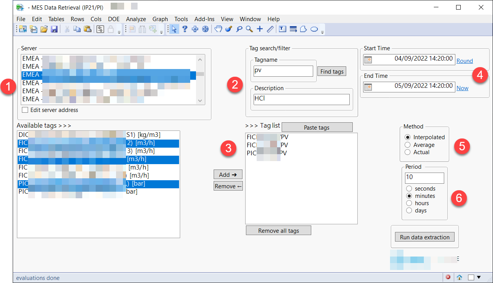
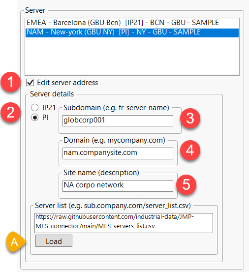
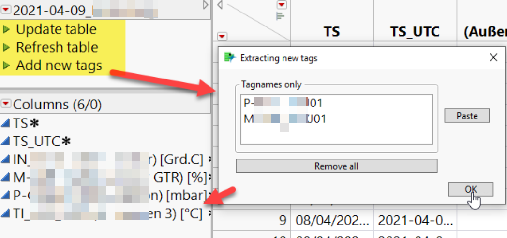
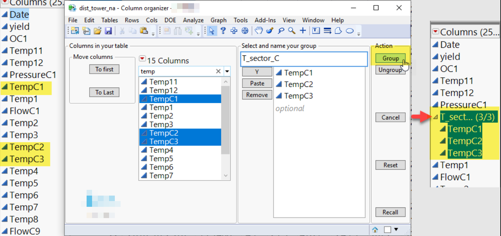
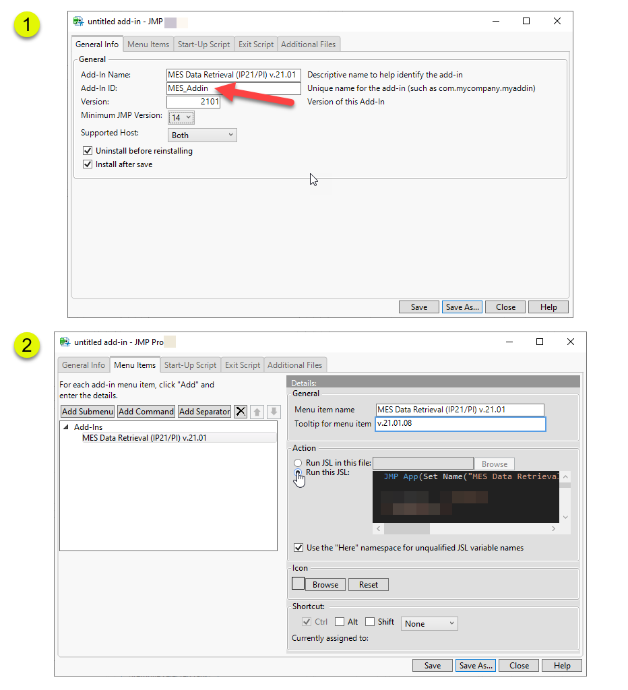

# MES data retrieval add-in - Aspentech IP.21 and Osisoft PI (Aveva)

Aspentech IP.21 and Osisoft PI connector to JMP (SAS Institute), you can find a walk-through demo [here](https://community.jmp.com/t5/Discovery-Summit-Europe-2023/Scaling-up-the-Use-of-Machine-Learning-in-Chemical-Process/ta-p/572644) (add-in shown at minute 21).

:inbox_tray: [Download latest version](https://github.com/industrial-data/JMP-MES-connector/raw/main/IP21PI_Data_Retrieval_v_latest.jmpaddin)

:inbox_tray: [+ Column organizer](https://github.com/industrial-data/JMP-MES-connector/raw/main/column_organizer/Column%20organizer%20v220905.jmpaddin)

This add-in automates data extraction tasks from Aspentech IP.21 and Osisoft PI (Aveva) historians.

This way, you can use JMP to diagnose manufacturing problems and monitor several tags daily and weekly.

Have a look at this [review](https://pubs.rsc.org/en/content/articlelanding/2022/re/d1re00541c) for more industrial data science applications.

If you would like JMP to support historians natively, give it a thumbs up in the [wishlist](https://community.jmp.com/t5/JMP-Wish-List/Native-Support-to-Manufacturing-Historians-Aspentech-IP-21-and/idi-p/540846).

Similar work: [JMP OsiPITools](https://github.com/himanga/JMPOSIPITools), [Tagreader Python library](https://github.com/equinor/tagreader-python).

# Requirements

- JMP v16 or higher
- Aspen Manufacturing Execution Systems (Aspen InfoPlus.21®) and the Aspen Dekstop Application. Particularly, you will need to have installed Aspen SQLplus and its 64-bit ODBC driver.
- OSIsoft PI Client Tools (PI Process Book) and its [PI OLEDB Enterprise driver](https://techsupport.osisoft.com/Products/PI-System-Access/PI-OLEDB-Enterprise/Overview).
- Hostname and access to the IP21/PI server of interest (usually via Window's active directory)
- Be connected to your enterprise network (usually via VPN).

Please contact your IT or OT support in case you are missing the packages or configuration above mentioned.

# Functionalities

The **interface** allows users to:

1. Select a server from a server list or manual input (edit server address)
2. Find tags showing them in a table using either tag name or description
3. Add selected tags or paste tag names when copied from a spreadsheet
4. Filter by start and end date (now and 24 h earlier by default)
5. Select the extraction type (interpolated, average and actual values)
6. Select the extraction period (10 minutes by default)

To use the add-in, make sure to put your server details properly:

1. You can edit the server name from the list by using this checbox
2. Make sure the proper server type is selected (IP.21 or PI)
3. Introduce your server name address (e.g., globcorp001)
4. Introduce the domain, usually this is optional
5. (Optional) Include a description 

Note: (A) You can load your own server list (URL or file path pointing to a CSV).

The extraction is done tag by tag with a high limit of rows (100,000) per tag to not saturate the server.

You can check the log to track the progress of the data extraction. It should be fast enough for most cases unless limited by connectivity speed (e.g., VPN). Please notify in advance your OT/IT team if you are planning for massive data extractions.

After you extract data for both IP21/PI servers, you can UPDATE, REFRESH, and ADD new tags to the table with one click.

The timestamp in UTC format (TS\_UTC column) will be used, so keep it in your table. Likewise, if you want to change the names of your tag columns, we recommend creating new columns using formulas to refer to them.

# What's the difference between update() and refresh()?

Both will automatically obtain recent data from MES.

- UPDATE increments the table size (adding new rows below)
- REFRESH keeps the same table size (updating first and then deleting old data from the top, so it maintains the number of rows).

Use update() to keep track of all new and old data.

# How can I organize all the tags (columns) after the extraction?

You can easily group and ungroup the tags with our Column Organizer add-in

[Download](https://github.com/industrial-data/JMP-MES-connector/raw/main/column_organizer/Column%20organizer%20v220905.jmpaddin)

# License

This add-in is open-source (BSD clause 3).

# Serverlist

If you have a list of servers, you can load it using the example provided on GitHub. Notice the "MES\_serverlist.csv" should have ";" instead of "," to work.

To have as a new default your own server list, change the address in the GUI editor within the source code.

# Creating your add-in

You can modify the source code and GUI at your will. The requisite is to keep the specific ID as "MES\_Addin". The steps to go from source code to add-in can be seen below.

# Known issues

If JMP Log window shows timeout errors when extracting PI data, please consider increasing timeout times in PI SDK.

You can also contact your PI administrator to understand why long connection times occur.

# Roadmap

We have several improvements in mind.

- Code refactoring (IP21/PI data steps as external functions to avoid code duplication).
- Migrate to RestAPI authentication
- Add filters by tag value (e.g., product grade)
- Add more extraction options

Meanwhile, suggestions, issues, and pull requests are more than welcome.
